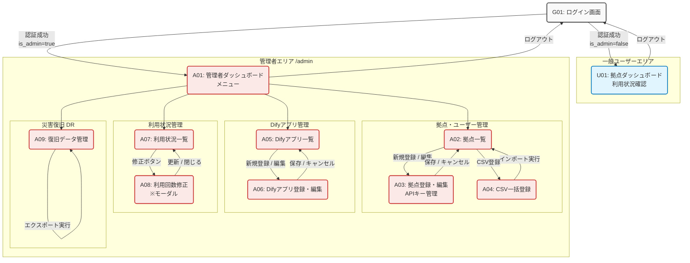

# **画面一覧・機能一覧定義書**

## **1\. 画面構成図（サイトマップ概要）**

* **共通エリア**  
  * G01: ログイン画面  
* **一般ユーザーエリア (拠点担当者)**  
  * U01: ダッシュボード（利用状況確認）  
* **管理者エリア**  
  * ※URLプレフィックスはセキュリティ向上のため環境変数で変更可能とする (例: /manage\_x9z)  
  * A01: 管理者ダッシュボード（メニュー概要）  
  * **拠点・ユーザー管理**  
    * A02: 拠点一覧  
    * A03: 拠点登録・編集（APIキー管理含む）  
    * A04: CSV一括登録  
  * **Difyアプリ管理**  
    * A05: Difyアプリ一覧  
    * A06: Difyアプリ登録・編集  
  * **利用状況管理**  
    * A07: 利用状況一覧  
    * A08: 利用回数修正（モーダル等）  
  * **災害復旧 (DR)**  
    * A09: 復旧データエクスポート

## **2\. 画面・機能詳細一覧**

### **2.1 共通・一般ユーザー向け**

| 画面ID | 画面名称 | URL例 | 機能詳細 | 備考 |
| :---- | :---- | :---- | :---- | :---- |
| **G01** | **ログイン画面** | /login | ・メールアドレス/パスワードによる認証 ・is\_admin フラグによるリダイレクト先振り分け \- 管理者 (true) → A01 \- 一般 (false) → U01 | Jetstream標準機能を利用 |
| **U01** | **拠点ダッシュボード** | /dashboard | **【閲覧のみ】** ・現在の契約プラン名表示 ・プランの月間リクエスト上限数表示 ・**利用状況グラフ表示**（Difyアプリ別） \- 利用回数 / 上限回数 \- プログレスバー（消化率） \- 残り利用可能回数 | 自身のチーム (currentTeam) の情報のみを表示する |

### **2.2 管理者向け (Admin Guard適用)**

※全ての画面アクセス時に is\_admin \= true の権限チェックを行う。

#### **① 拠点・ユーザー管理**

| 画面ID | 画面名称 | URL例 | 機能詳細 | 備考 |
| :---- | :---- | :---- | :---- | :---- |
| **A02** | **拠点一覧** | /.../teams | ・登録済み拠点（チーム）のリスト表示 ・**検索・絞り込み機能** \- チーム名、メールアドレス、契約プラン ・新規登録ボタン（→A03） ・CSV登録ボタン（→A04） ・編集ボタン（→A03） |  |
| **A03** | **拠点登録・編集** | /.../teams/{id} | ・ユーザー情報編集（名前、メール、PWリセット） ・チーム情報編集（名称） ・**契約プラン変更**（プルダウン選択） ・**固定APIキー管理セクション** \- 現在のキー識別名の表示 \- **「キーを表示」ボタン**（復号して平文表示） \- **「キー再発行」ボタン**（任意文字列入力→上書き保存） | ユーザーとチームをセットで管理するUIとする |
| **A04** | **CSV一括登録** | /.../teams/import | ・CSVファイルアップロード ・バリデーションチェック（形式、重複確認） ・一括登録実行 (User作成→Team作成→Plan紐付け→Key登録) ・結果/エラーログ表示 | 拠点開設時の初期登録用 |

#### **② Difyアプリ管理**

| 画面ID | 画面名称 | URL例 | 機能詳細 | 備考 |
| :---- | :---- | :---- | :---- | :---- |
| **A05** | **Difyアプリ一覧** | /.../apps | ・登録済みDifyアプリのリスト表示 ・**検索機能**（アプリ名、スラッグ） ・ステータス表示（有効/無効） ・新規登録ボタン（→A06） ・編集/削除ボタン |  |
| **A06** | **Difyアプリ登録・編集** | /.../apps/{id} | ・アプリ名入力 ・**スラッグ設定**（URLパス用ID、重複不可） ・**Dify APIキー入力**（DB保存時は暗号化） ・有効/無効切り替え |  |

#### **③ 利用状況・制限管理**

| 画面ID | 画面名称 | URL例 | 機能詳細 | 備考 |
| :---- | :---- | :---- | :---- | :---- |
| **A07** | **利用状況一覧** | /.../usages | ・月次利用実績(monthly\_api\_usages)リスト表示 ・**検索・絞り込み機能** \- 年月（YYYY-MM） \- 拠点名 \- Difyアプリ名 ・各レコードの編集ボタン（→A08） |  |
| **A08** | **利用回数修正** | (Modal等) | ・現在のカウント数の表示 ・**カウント数の手動修正** （誤課金訂正、トラブル時の補填など） | A07からモーダル等で呼び出し |

#### **④ 災害復旧 (DR)**

| 画面ID | 画面名称 | URL例 | 機能詳細 | 備考 |
| :---- | :---- | :---- | :---- | :---- |
| **A09** | **復旧データ管理** | /.../backup | ・**「復旧データエクスポート」ボタン** \- 全拠点情報・プラン紐付け・\*\*全APIキー（復号済み平文）\*\*を含むJSONファイルを生成・ダウンロード ・運用手順の説明表示（Gitへのコミット方法など） | サーバーデータ消失対策 |

## **3\. UI/UXの補足事項**

1. **ナビゲーション設計:**  
   * **一般ユーザー:** ヘッダー右上に「ログアウト」「プロフィール」のみ。メインコンテンツはダッシュボード。  
   * **管理者:** サイドバー（またはヘッダー）に「拠点管理」「アプリ管理」「利用状況」「DR管理」のメニューを配置し、アクセスしやすくする。  
2. **APIキーの表示制御 (セキュリティ):**  
   * A03画面を開いた初期状態では、APIキーは sk\_live\_\*\*\*\*\* のようにマスク表示する。  
   * 「表示する」ボタン押下時のみ、Livewireのアクションで復号処理を行い、平文を表示する（ショルダーハッキング対策）。  
3. **検索UI:**  
   * 各一覧画面 (A02, A05, A07) の上部には検索ボックスおよびフィルタープルダウンを配置する。  
   * Livewireを用いて、非同期でのリアルタイム検索（または検索ボタン押下による更新）を実装し、大量データ時でも操作性を損なわないようにする。