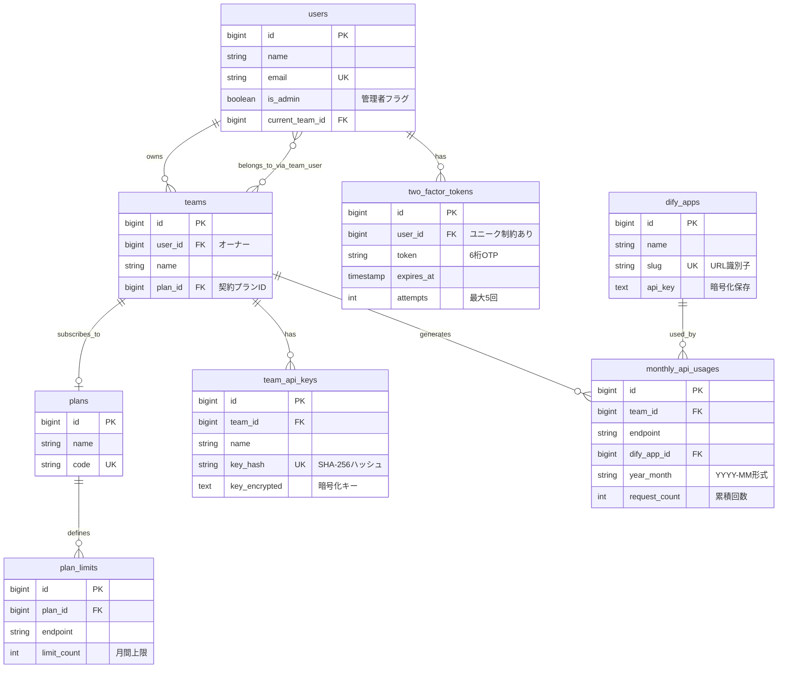

# データベース定義書

**プロジェクト:** rasinban-ai-studio (Dify中継・管理プラットフォーム)
**作成日:** 2026-02-12
**対象DBMS:** PostgreSQL 16+

## 目次

1. [テーブル一覧](#1-テーブル一覧)
2. [テーブル定義詳細](#2-テーブル定義詳細)
   - [2.1 ユーザー・認証関連](#21-ユーザー認証関連)
   - [2.2 拠点・契約管理](#22-拠点契約管理)
   - [2.3 Dify連携管理](#23-dify連携管理)
   - [2.4 利用状況管理](#24-利用状況管理)
3. [ER図](#3-er図)
4. [インデックス設計](#4-インデックス設計)
5. [制約・ルール](#5-制約ルール)
6. [マイグレーション実装状況](#6-マイグレーション実装状況)

---

## 1. テーブル一覧

| # | テーブル名 | 説明 | 実装状況 |
|---|-----------|------|---------|
| 1 | `users` | ユーザー情報（管理者・一般ユーザー） | ✅ 既存 (要拡張) |
| 2 | `password_reset_tokens` | パスワードリセット用トークン | ✅ 既存 |
| 3 | `sessions` | セッション管理 | ✅ 既存 |
| 4 | `teams` | 拠点（チーム）情報 | ✅ 既存 (要拡張) |
| 5 | `team_user` | ユーザー・チーム中間テーブル | ✅ 既存 |
| 6 | `team_invitations` | チーム招待管理 | ✅ 既存 |
| 7 | `team_api_keys` | 拠点認証用固定APIキー | ❌ 未実装 |
| 8 | `plans` | 契約プラン定義 | ❌ 未実装 |
| 9 | `plan_limits` | プランごとのエンドポイント上限 | ❌ 未実装 |
| 10 | `dify_apps` | Dify接続先設定 | ❌ 未実装 |
| 11 | `monthly_api_usages` | 月次API利用実績 | ❌ 未実装 |
| 12 | `two_factor_tokens` | 管理者用OTP認証トークン | ❌ 未実装 |

---

## 2. テーブル定義詳細

### 2.1 ユーザー・認証関連

#### **① users** (既存テーブル - 拡張必要)

**用途:** システム利用者（管理者・一般ユーザー）の情報管理

| カラム名 | 型 | Null | Default | 説明 |
|---------|---|------|---------|------|
| id | BIGSERIAL | NO | AUTO | 主キー |
| name | VARCHAR(255) | NO | - | ユーザー名 |
| email | VARCHAR(255) | NO | - | メールアドレス（ユニーク） |
| email_verified_at | TIMESTAMP | YES | NULL | メール確認日時 |
| password | VARCHAR(255) | NO | - | パスワード（ハッシュ化） |
| remember_token | VARCHAR(100) | YES | NULL | Remember Me トークン |
| current_team_id | BIGINT | YES | NULL | 現在選択中のチームID |
| profile_photo_path | VARCHAR(2048) | YES | NULL | プロフィール画像パス |
| **is_admin** | BOOLEAN | NO | FALSE | **管理者フラグ（要追加）** |
| two_factor_secret | TEXT | YES | NULL | 二段階認証シークレット |
| two_factor_recovery_codes | TEXT | YES | NULL | 二段階認証リカバリーコード |
| two_factor_confirmed_at | TIMESTAMP | YES | NULL | 二段階認証確認日時 |
| created_at | TIMESTAMP | YES | NULL | 作成日時 |
| updated_at | TIMESTAMP | YES | NULL | 更新日時 |

**インデックス:**
- PRIMARY KEY (`id`)
- UNIQUE KEY (`email`)
- INDEX (`current_team_id`)
- **INDEX (`is_admin`)** ← 要追加

**外部キー:**
- `current_team_id` → `teams.id` (ON DELETE SET NULL)

**備考:**
- Jetstream標準テーブルに `is_admin` カラムを追加する
- `true` = 管理者、`false` = 一般ユーザー（拠点担当者）
- 管理者は二段階認証（OTP）が必須

---

#### **② password_reset_tokens** (既存)

**用途:** パスワードリセット時のトークン管理

| カラム名 | 型 | Null | Default | 説明 |
|---------|---|------|---------|------|
| email | VARCHAR(255) | NO | - | メールアドレス（主キー） |
| token | VARCHAR(255) | NO | - | リセットトークン |
| created_at | TIMESTAMP | YES | NULL | 作成日時 |

**インデックス:**
- PRIMARY KEY (`email`)

**備考:**
- Laravel標準機能（変更不要）

---

#### **③ sessions** (既存)

**用途:** セッション管理

| カラム名 | 型 | Null | Default | 説明 |
|---------|---|------|---------|------|
| id | VARCHAR(255) | NO | - | セッションID（主キー） |
| user_id | BIGINT | YES | NULL | ユーザーID |
| ip_address | VARCHAR(45) | YES | NULL | IPアドレス |
| user_agent | TEXT | YES | NULL | ユーザーエージェント |
| payload | TEXT | NO | - | セッションデータ |
| last_activity | INTEGER | NO | - | 最終アクティビティ時刻 |

**インデックス:**
- PRIMARY KEY (`id`)
- INDEX (`user_id`)
- INDEX (`last_activity`)

**備考:**
- Laravel標準機能（変更不要）

---

#### **④ two_factor_tokens** (新規作成)

**用途:** 管理者ログイン時のOTP認証トークン管理

| カラム名 | 型 | Null | Default | 説明 |
|---------|---|------|---------|------|
| id | BIGSERIAL | NO | AUTO | 主キー |
| user_id | BIGINT | NO | - | ユーザーID（ユニーク） |
| token | VARCHAR(6) | NO | - | **6桁OTPコード（平文保存）** |
| expires_at | TIMESTAMP | NO | - | 有効期限（生成時刻 + 10分） |
| attempts | INTEGER | NO | 0 | 試行回数（最大5回） |
| created_at | TIMESTAMP | YES | NULL | 作成日時 |

**インデックス:**
- PRIMARY KEY (`id`)
- UNIQUE KEY (`user_id`)
- INDEX (`expires_at`)

**外部キー:**
- `user_id` → `users.id` (ON DELETE CASCADE)

**備考:**
- **管理者専用機能**（is_admin = true のユーザーのみ）
- トークンは6桁数字（ハッシュ化せず平文保存）
- 有効期限切れトークンは定期的に削除（Artisan Commandで実装）
- 試行回数が5回を超えたらログアウト強制

---

### 2.2 拠点・契約管理

#### **⑤ teams** (既存テーブル - 拡張必要)

**用途:** 拠点（契約主体）の情報管理

| カラム名 | 型 | Null | Default | 説明 |
|---------|---|------|---------|------|
| id | BIGSERIAL | NO | AUTO | 主キー |
| user_id | BIGINT | NO | - | オーナーユーザーID |
| name | VARCHAR(255) | NO | - | チーム名（拠点名） |
| personal_team | BOOLEAN | NO | FALSE | 個人チームフラグ |
| **plan_id** | BIGINT | YES | NULL | **契約プランID（要追加）** |
| created_at | TIMESTAMP | YES | NULL | 作成日時 |
| updated_at | TIMESTAMP | YES | NULL | 更新日時 |

**インデックス:**
- PRIMARY KEY (`id`)
- INDEX (`user_id`)
- **INDEX (`plan_id`)** ← 要追加

**外部キー:**
- `user_id` → `users.id` (ON DELETE CASCADE)
- **`plan_id` → `plans.id` (ON DELETE SET NULL)** ← 要追加

**備考:**
- Jetstream標準テーブルに `plan_id` カラムを追加する
- プランが削除された場合は NULL になる

---

#### **⑥ team_user** (既存)

**用途:** ユーザーとチームの多対多関係

| カラム名 | 型 | Null | Default | 説明 |
|---------|---|------|---------|------|
| id | BIGSERIAL | NO | AUTO | 主キー |
| team_id | BIGINT | NO | - | チームID |
| user_id | BIGINT | NO | - | ユーザーID |
| role | VARCHAR(255) | YES | NULL | ロール（owner, admin, member等） |
| created_at | TIMESTAMP | YES | NULL | 作成日時 |
| updated_at | TIMESTAMP | YES | NULL | 更新日時 |

**インデックス:**
- PRIMARY KEY (`id`)
- UNIQUE KEY (`team_id`, `user_id`)

**外部キー:**
- `team_id` → `teams.id` (ON DELETE CASCADE)
- `user_id` → `users.id` (ON DELETE CASCADE)

**備考:**
- Jetstream標準機能（変更不要）

---

#### **⑦ team_invitations** (既存)

**用途:** チーム招待管理

| カラム名 | 型 | Null | Default | 説明 |
|---------|---|------|---------|------|
| id | BIGSERIAL | NO | AUTO | 主キー |
| team_id | BIGINT | NO | - | チームID |
| email | VARCHAR(255) | NO | - | 招待先メールアドレス |
| role | VARCHAR(255) | YES | NULL | 招待ロール |
| created_at | TIMESTAMP | YES | NULL | 作成日時 |
| updated_at | TIMESTAMP | YES | NULL | 更新日時 |

**インデックス:**
- PRIMARY KEY (`id`)
- UNIQUE KEY (`team_id`, `email`)

**外部キー:**
- `team_id` → `teams.id` (ON DELETE CASCADE)

**備考:**
- Jetstream標準機能（変更不要）

---

#### **⑧ team_api_keys** (新規作成)

**用途:** 拠点がAPI中継を利用するための固定認証キー

| カラム名 | 型 | Null | Default | 説明 |
|---------|---|------|---------|------|
| id | BIGSERIAL | NO | AUTO | 主キー |
| team_id | BIGINT | NO | - | チームID |
| name | VARCHAR(255) | NO | - | 識別名（例: Gateway_01） |
| key_hash | VARCHAR(64) | NO | - | **認証用ハッシュ（SHA-256）** |
| key_encrypted | TEXT | NO | - | **表示用暗号化キー（Laravel Encrypt）** |
| last_used_at | TIMESTAMP | YES | NULL | 最終利用日時 |
| created_at | TIMESTAMP | YES | NULL | 作成日時 |
| updated_at | TIMESTAMP | YES | NULL | 更新日時 |

**インデックス:**
- PRIMARY KEY (`id`)
- INDEX (`team_id`)
- **UNIQUE INDEX (`key_hash`)** ← 高速検索用

**外部キー:**
- `team_id` → `teams.id` (ON DELETE CASCADE)

**備考:**
- **2重保存方式**:
  - `key_hash`: SHA-256でハッシュ化（高速認証用、インデックス付き）
  - `key_encrypted`: Laravel Encryptで暗号化（復号表示用）
- APIリクエスト時は `key_hash` でインデックス検索
- 管理画面での表示時は `key_encrypted` を復号化
- **セキュリティ**: 平文は保存しない

---

#### **⑨ plans** (新規作成)

**用途:** 契約プラン定義

| カラム名 | 型 | Null | Default | 説明 |
|---------|---|------|---------|------|
| id | BIGSERIAL | NO | AUTO | 主キー |
| name | VARCHAR(255) | NO | - | プラン名（例: Light, Standard, Pro） |
| code | VARCHAR(255) | NO | - | 識別コード（例: light, standard, pro） |
| description | TEXT | YES | NULL | プラン説明 |
| is_active | BOOLEAN | NO | TRUE | 有効フラグ |
| created_at | TIMESTAMP | YES | NULL | 作成日時 |
| updated_at | TIMESTAMP | YES | NULL | 更新日時 |

**インデックス:**
- PRIMARY KEY (`id`)
- UNIQUE KEY (`code`)
- INDEX (`is_active`)

**備考:**
- プランごとの月間リクエスト上限は `plan_limits` テーブルで管理
- プラン削除時は `is_active = false` にして論理削除推奨

---

#### **⑩ plan_limits** (新規作成)

**用途:** プランごとのエンドポイント別月間リクエスト上限設定

| カラム名 | 型 | Null | Default | 説明 |
|---------|---|------|---------|------|
| id | BIGSERIAL | NO | AUTO | 主キー |
| plan_id | BIGINT | NO | - | プランID |
| endpoint | VARCHAR(255) | NO | - | エンドポイントパターン（例: `/relay/translator/v1/chat-messages`） |
| limit_count | INTEGER | NO | - | 月間許容回数 |
| created_at | TIMESTAMP | YES | NULL | 作成日時 |
| updated_at | TIMESTAMP | YES | NULL | 更新日時 |

**インデックス:**
- PRIMARY KEY (`id`)
- UNIQUE KEY (`plan_id`, `endpoint`)

**外部キー:**
- `plan_id` → `plans.id` (ON DELETE CASCADE)

**備考:**
- エンドポイントは完全一致または前方一致で判定
- プランごとに複数のエンドポイント上限を設定可能

---

### 2.3 Dify連携管理

#### **⑪ dify_apps** (新規作成)

**用途:** Dify API接続先の設定管理

| カラム名 | 型 | Null | Default | 説明 |
|---------|---|------|---------|------|
| id | BIGSERIAL | NO | AUTO | 主キー |
| name | VARCHAR(255) | NO | - | アプリ名（例: 翻訳Bot, 営業支援AI） |
| slug | VARCHAR(255) | NO | - | **URL識別子（例: translator, sales-bot）** |
| api_key | TEXT | NO | - | **Dify APIキー（暗号化保存）** |
| base_url | VARCHAR(255) | YES | NULL | Dify API基底URL（デフォルト: 環境変数） |
| description | TEXT | YES | NULL | アプリ説明 |
| is_active | BOOLEAN | NO | TRUE | 有効フラグ |
| created_at | TIMESTAMP | YES | NULL | 作成日時 |
| updated_at | TIMESTAMP | YES | NULL | 更新日時 |

**インデックス:**
- PRIMARY KEY (`id`)
- **UNIQUE KEY (`slug`)** ← URL解決用
- INDEX (`is_active`)

**備考:**
- `slug`: URLパス `/relay/{slug}/v1/...` で使用
- `api_key`: Laravel Encryptで暗号化保存
- `base_url`: NULL の場合は環境変数 `DIFY_BASE_URL` を使用

---

### 2.4 利用状況管理

#### **⑫ monthly_api_usages** (新規作成)

**用途:** 月次API利用実績の記録（メタデータのみ、プロンプト内容は保存しない）

| カラム名 | 型 | Null | Default | 説明 |
|---------|---|------|---------|------|
| id | BIGSERIAL | NO | AUTO | 主キー |
| team_id | BIGINT | NO | - | 利用チームID |
| endpoint | VARCHAR(255) | NO | - | リクエストURI（例: `/relay/sales-bot/v1/chat-messages`） |
| dify_app_id | BIGINT | YES | NULL | DifyアプリID |
| year_month | VARCHAR(7) | NO | - | 年月（`YYYY-MM`形式） |
| request_count | INTEGER | NO | 0 | 月間リクエスト回数（累積） |
| tokens_consumed | INTEGER | YES | NULL | 消費トークン数（オプション） |
| created_at | TIMESTAMP | YES | NULL | 作成日時 |
| updated_at | TIMESTAMP | YES | NULL | 更新日時 |

**インデックス:**
- PRIMARY KEY (`id`)
- **UNIQUE KEY (`team_id`, `endpoint`, `year_month`)** ← 月次集計キー
- INDEX (`dify_app_id`)
- INDEX (`year_month`)

**外部キー:**
- `team_id` → `teams.id` (ON DELETE CASCADE)
- `dify_app_id` → `dify_apps.id` (ON DELETE SET NULL)

**備考:**
- **月次自動切替方式**: 年月が変わると新規レコードが自動生成される（月次リセット不要）
- `request_count`: API呼び出しごとにインクリメント
- `tokens_consumed`: Difyレスポンスから取得（オプション）
- **プライバシー保護**: プロンプト内容は一切保存しない

---

## 3. ER図



---

## 4. インデックス設計

### 高速検索が必要なカラム

| テーブル | カラム | インデックス種別 | 用途 |
|---------|-------|---------------|------|
| `users` | `email` | UNIQUE | ログイン時のユーザー検索 |
| `users` | `is_admin` | INDEX | 管理者権限チェック |
| `teams` | `plan_id` | INDEX | プラン紐付け検索 |
| `team_api_keys` | `key_hash` | UNIQUE | **API認証時の高速検索（最重要）** |
| `plans` | `code` | UNIQUE | プラン識別 |
| `plan_limits` | `(plan_id, endpoint)` | UNIQUE | 制限チェック |
| `dify_apps` | `slug` | UNIQUE | **URL解決時の高速検索（重要）** |
| `monthly_api_usages` | `(team_id, endpoint, year_month)` | UNIQUE | 月次集計の一意性保証 |
| `two_factor_tokens` | `user_id` | UNIQUE | OTP検証 |

---

## 5. 制約・ルール

### データ整合性ルール

1. **ユーザー削除時**:
   - 所有チーム、APIキー、利用実績も連鎖削除（CASCADE）

2. **チーム削除時**:
   - APIキー、利用実績も連鎖削除（CASCADE）

3. **プラン削除時**:
   - チームの `plan_id` は NULL に設定（SET NULL）
   - プラン制限は連鎖削除（CASCADE）

4. **APIキー管理**:
   - 平文は保存しない
   - 認証用: SHA-256ハッシュ（`key_hash`）
   - 表示用: Laravel Encrypt（`key_encrypted`）

5. **Dify APIキー管理**:
   - 必ず暗号化して保存（Laravel Encrypt）

6. **月次利用実績**:
   - `(team_id, endpoint, year_month)` の複合ユニーク制約
   - 年月が変わると自動的に新規レコード生成

---

## 6. マイグレーション実装状況

### 既存マイグレーション（Jetstream標準）

- ✅ `0001_01_01_000000_create_users_table.php`
- ✅ `2014_10_12_200000_add_two_factor_columns_to_users_table.php`
- ✅ `2020_05_21_100000_create_teams_table.php`
- ✅ `2020_05_21_200000_create_team_user_table.php`
- ✅ `2020_05_21_300000_create_team_invitations_table.php`

### 追加が必要なマイグレーション

#### Phase 1: 既存テーブル拡張

```bash
# 1. usersテーブルにis_adminカラムを追加
php artisan make:migration add_is_admin_to_users_table --table=users

# 2. teamsテーブルにplan_idカラムを追加
php artisan make:migration add_plan_id_to_teams_table --table=teams
```

#### Phase 2: 新規テーブル作成

```bash
# 3. 契約プラン関連
php artisan make:migration create_plans_table
php artisan make:migration create_plan_limits_table

# 4. API認証・Dify連携
php artisan make:migration create_team_api_keys_table
php artisan make:migration create_dify_apps_table

# 5. 利用実績・二段階認証
php artisan make:migration create_monthly_api_usages_table
php artisan make:migration create_two_factor_tokens_table
```

### 実装順序

**優先度順に実装:**

1. **High（基盤）**: `plans`, `add_plan_id_to_teams`, `add_is_admin_to_users`
2. **High（認証）**: `team_api_keys`, `two_factor_tokens`
3. **High（中継）**: `dify_apps`, `monthly_api_usages`
4. **Medium（機能拡張）**: `plan_limits`

---

## 補足事項

### セキュリティ考慮事項

1. **APIキーの二重暗号化**:
   - 認証: ハッシュ検索（高速）
   - 表示: 暗号化復号（セキュア）

2. **プライバシー保護**:
   - プロンプト内容は `monthly_api_usages` に保存しない
   - メタデータ（回数、トークン数）のみ記録

3. **管理者認証**:
   - 二段階認証（OTP）必須
   - トークン有効期限10分、試行回数5回まで

### パフォーマンス最適化

1. **API中継時の検索最適化**:
   - `team_api_keys.key_hash` にユニークインデックス
   - `dify_apps.slug` にユニークインデックス

2. **月次集計の高速化**:
   - `(team_id, endpoint, year_month)` 複合インデックス
   - パーティショニング（将来的な検討）

3. **管理画面検索の最適化**:
   - 検索頻度の高いカラムにインデックス追加
   - `users.email`, `teams.name` 等

---

## 変更履歴

| 日付 | 変更内容 | 変更者 |
|------|---------|-------|
| 2026-02-12 | 初版作成（要件定義書・機能一覧定義書より作成） | AI |

---

**以上、データベース定義書**
