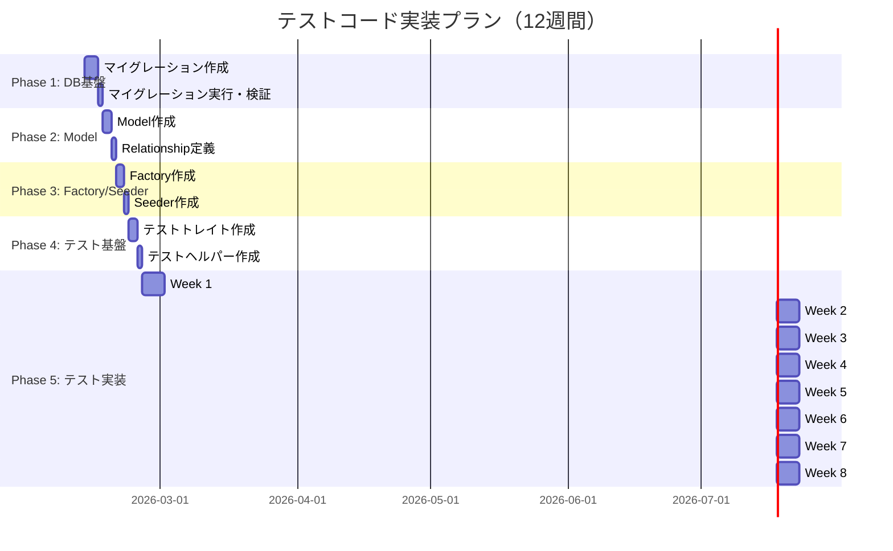

# テストコード実装プラン

**プロジェクト:** rasinban-ai-studio (Dify中継・管理プラットフォーム)
**作成日:** 2026-02-12
**対象:** テストコード実装前の基盤整備 → テストコード実装（410ケース）

## 目次

1. [全体スケジュール](#1-全体スケジュール)
2. [Phase 1: データベース基盤構築](#phase-1-データベース基盤構築)
3. [Phase 2: Model & Relationship定義](#phase-2-model--relationship定義)
4. [Phase 3: Factory & Seeder作成](#phase-3-factory--seeder作成)
5. [Phase 4: テスト基盤整備](#phase-4-テスト基盤整備)
6. [Phase 5: テストコード実装](#phase-5-テストコード実装)
7. [実装チェックリスト](#実装チェックリスト)

---

## 1. 全体スケジュール

### タイムライン（12週間）



---

## Phase 1: データベース基盤構築

**期間:** 3〜4日
**目標:** プロジェクト独自の7テーブルとカラム追加

### 1.1 マイグレーション作成順序

#### **優先度1: 基盤テーブル（依存なし）**

```bash
# 1. 契約プラン
php artisan make:migration create_plans_table

# 2. Difyアプリ
php artisan make:migration create_dify_apps_table

# 3. 既存テーブル拡張（依存なし）
php artisan make:migration add_is_admin_to_users_table --table=users
```

#### **優先度2: 依存テーブル（plans依存）**

```bash
# 4. プラン制限（plans依存）
php artisan make:migration create_plan_limits_table

# 5. チーム拡張（plans依存）
php artisan make:migration add_plan_id_to_teams_table --table=teams
```

#### **優先度3: 認証・利用実績テーブル**

```bash
# 6. 拠点APIキー（teams依存）
php artisan make:migration create_team_api_keys_table

# 7. 二段階認証トークン（users依存）
php artisan make:migration create_two_factor_tokens_table

# 8. 月次利用実績（teams, dify_apps依存）
php artisan make:migration create_monthly_api_usages_table
```

---

### 1.2 マイグレーションファイル詳細

#### **① create_plans_table.php**

```php
<?php

use Illuminate\Database\Migrations\Migration;
use Illuminate\Database\Schema\Blueprint;
use Illuminate\Support\Facades\Schema;

return new class extends Migration
{
    public function up(): void
    {
        Schema::create('plans', function (Blueprint $table) {
            $table->id();
            $table->string('name');                    // プラン名
            $table->string('code')->unique();          // 識別コード
            $table->text('description')->nullable();   // プラン説明
            $table->boolean('is_active')->default(true);
            $table->timestamps();
        });
    }

    public function down(): void
    {
        Schema::dropIfExists('plans');
    }
};
```

#### **② create_plan_limits_table.php**

```php
<?php

use Illuminate\Database\Migrations\Migration;
use Illuminate\Database\Schema\Blueprint;
use Illuminate\Support\Facades\Schema;

return new class extends Migration
{
    public function up(): void
    {
        Schema::create('plan_limits', function (Blueprint $table) {
            $table->id();
            $table->foreignId('plan_id')->constrained()->onDelete('cascade');
            $table->string('endpoint');                // エンドポイントパターン
            $table->integer('limit_count');            // 月間許容回数
            $table->timestamps();

            // 複合ユニーク制約
            $table->unique(['plan_id', 'endpoint']);
        });
    }

    public function down(): void
    {
        Schema::dropIfExists('plan_limits');
    }
};
```

#### **③ add_is_admin_to_users_table.php**

```php
<?php

use Illuminate\Database\Migrations\Migration;
use Illuminate\Database\Schema\Blueprint;
use Illuminate\Support\Facades\Schema;

return new class extends Migration
{
    public function up(): void
    {
        Schema::table('users', function (Blueprint $table) {
            $table->boolean('is_admin')->default(false)->after('email_verified_at');
            $table->index('is_admin'); // 管理者検索用
        });
    }

    public function down(): void
    {
        Schema::table('users', function (Blueprint $table) {
            $table->dropIndex(['is_admin']);
            $table->dropColumn('is_admin');
        });
    }
};
```

#### **④ add_plan_id_to_teams_table.php**

```php
<?php

use Illuminate\Database\Migrations\Migration;
use Illuminate\Database\Schema\Blueprint;
use Illuminate\Support\Facades\Schema;

return new class extends Migration
{
    public function up(): void
    {
        Schema::table('teams', function (Blueprint $table) {
            $table->foreignId('plan_id')->nullable()->after('personal_team')
                  ->constrained()->onDelete('set null');
            $table->index('plan_id');
        });
    }

    public function down(): void
    {
        Schema::table('teams', function (Blueprint $table) {
            $table->dropForeign(['plan_id']);
            $table->dropIndex(['plan_id']);
            $table->dropColumn('plan_id');
        });
    }
};
```

#### **⑤ create_team_api_keys_table.php**

```php
<?php

use Illuminate\Database\Migrations\Migration;
use Illuminate\Database\Schema\Blueprint;
use Illuminate\Support\Facades\Schema;

return new class extends Migration
{
    public function up(): void
    {
        Schema::create('team_api_keys', function (Blueprint $table) {
            $table->id();
            $table->foreignId('team_id')->constrained()->onDelete('cascade');
            $table->string('name');                    // 識別名
            $table->string('key_hash', 64)->unique();  // SHA-256ハッシュ（認証用）
            $table->text('key_encrypted');             // Laravel Encrypt（表示用）
            $table->timestamp('last_used_at')->nullable();
            $table->timestamps();

            // 高速検索用インデックス
            $table->index('team_id');
        });
    }

    public function down(): void
    {
        Schema::dropIfExists('team_api_keys');
    }
};
```

#### **⑥ create_dify_apps_table.php**

```php
<?php

use Illuminate\Database\Migrations\Migration;
use Illuminate\Database\Schema\Blueprint;
use Illuminate\Support\Facades\Schema;

return new class extends Migration
{
    public function up(): void
    {
        Schema::create('dify_apps', function (Blueprint $table) {
            $table->id();
            $table->string('name');                    // アプリ名
            $table->string('slug')->unique();          // URL識別子
            $table->text('api_key');                   // Dify APIキー（暗号化）
            $table->string('base_url')->nullable();    // 基底URL
            $table->text('description')->nullable();
            $table->boolean('is_active')->default(true);
            $table->timestamps();

            // slug検索用インデックス（既にuniqueで作成される）
            $table->index('is_active');
        });
    }

    public function down(): void
    {
        Schema::dropIfExists('dify_apps');
    }
};
```

#### **⑦ create_two_factor_tokens_table.php**

```php
<?php

use Illuminate\Database\Migrations\Migration;
use Illuminate\Database\Schema\Blueprint;
use Illuminate\Support\Facades\Schema;

return new class extends Migration
{
    public function up(): void
    {
        Schema::create('two_factor_tokens', function (Blueprint $table) {
            $table->id();
            $table->foreignId('user_id')->unique()->constrained()->onDelete('cascade');
            $table->string('token', 6);                // 6桁OTPコード
            $table->timestamp('expires_at');           // 有効期限
            $table->integer('attempts')->default(0);   // 試行回数
            $table->timestamp('created_at');

            // 有効期限検索用
            $table->index('expires_at');
        });
    }

    public function down(): void
    {
        Schema::dropIfExists('two_factor_tokens');
    }
};
```

#### **⑧ create_monthly_api_usages_table.php**

```php
<?php

use Illuminate\Database\Migrations\Migration;
use Illuminate\Database\Schema\Blueprint;
use Illuminate\Support\Facades\Schema;

return new class extends Migration
{
    public function up(): void
    {
        Schema::create('monthly_api_usages', function (Blueprint $table) {
            $table->id();
            $table->foreignId('team_id')->constrained()->onDelete('cascade');
            $table->string('endpoint');                // リクエストURI
            $table->foreignId('dify_app_id')->nullable()->constrained()->onDelete('set null');
            $table->string('year_month', 7);           // YYYY-MM
            $table->integer('request_count')->default(0);
            $table->integer('tokens_consumed')->nullable();
            $table->timestamps();

            // 複合ユニーク制約（月次集計キー）
            $table->unique(['team_id', 'endpoint', 'year_month']);

            // 検索用インデックス
            $table->index('dify_app_id');
            $table->index('year_month');
        });
    }

    public function down(): void
    {
        Schema::dropIfExists('monthly_api_usages');
    }
};
```

---

### 1.3 マイグレーション実行

```bash
# マイグレーション実行
./vendor/bin/sail artisan migrate

# 状態確認
./vendor/bin/sail artisan migrate:status

# データベース構造確認
./vendor/bin/sail artisan db:show --database=pgsql
```

---

### 1.4 Phase 1 完了条件

- ✅ 8つのマイグレーションファイル作成完了
- ✅ `sail artisan migrate` が成功
- ✅ 全14テーブルが存在（既存7 + 新規7）
- ✅ 外部キー制約が正常に設定
- ✅ インデックスが適切に作成

---

## Phase 2: Model & Relationship定義

**期間:** 2〜3日
**目標:** 7つの新規Modelクラスとリレーション定義

### 2.1 Model作成順序

```bash
# 優先度1: 基盤Model
./vendor/bin/sail artisan make:model Plan
./vendor/bin/sail artisan make:model DifyApp

# 優先度2: 依存Model
./vendor/bin/sail artisan make:model PlanLimit
./vendor/bin/sail artisan make:model TeamApiKey
./vendor/bin/sail artisan make:model TwoFactorToken
./vendor/bin/sail artisan make:model MonthlyApiUsage
```

---

### 2.2 Model詳細定義

#### **① Plan.php**

```php
<?php

namespace App\Models;

use Illuminate\Database\Eloquent\Factories\HasFactory;
use Illuminate\Database\Eloquent\Model;
use Illuminate\Database\Eloquent\Relations\HasMany;

class Plan extends Model
{
    use HasFactory;

    protected $fillable = [
        'name',
        'code',
        'description',
        'is_active',
    ];

    protected function casts(): array
    {
        return [
            'is_active' => 'boolean',
        ];
    }

    // Relationships
    public function teams(): HasMany
    {
        return $this->hasMany(Team::class);
    }

    public function limits(): HasMany
    {
        return $this->hasMany(PlanLimit::class);
    }

    // Scopes
    public function scopeActive($query)
    {
        return $query->where('is_active', true);
    }
}
```

#### **② PlanLimit.php**

```php
<?php

namespace App\Models;

use Illuminate\Database\Eloquent\Factories\HasFactory;
use Illuminate\Database\Eloquent\Model;
use Illuminate\Database\Eloquent\Relations\BelongsTo;

class PlanLimit extends Model
{
    use HasFactory;

    protected $fillable = [
        'plan_id',
        'endpoint',
        'limit_count',
    ];

    protected function casts(): array
    {
        return [
            'limit_count' => 'integer',
        ];
    }

    // Relationships
    public function plan(): BelongsTo
    {
        return $this->belongsTo(Plan::class);
    }
}
```

#### **③ TeamApiKey.php**

```php
<?php

namespace App\Models;

use Illuminate\Database\Eloquent\Factories\HasFactory;
use Illuminate\Database\Eloquent\Model;
use Illuminate\Database\Eloquent\Relations\BelongsTo;
use Illuminate\Support\Facades\Crypt;
use Illuminate\Support\Str;

class TeamApiKey extends Model
{
    use HasFactory;

    protected $fillable = [
        'team_id',
        'name',
        'key_hash',
        'key_encrypted',
        'last_used_at',
    ];

    protected $hidden = [
        'key_hash',
        'key_encrypted',
    ];

    protected function casts(): array
    {
        return [
            'last_used_at' => 'datetime',
        ];
    }

    // Relationships
    public function team(): BelongsTo
    {
        return $this->belongsTo(Team::class);
    }

    // Helpers
    public static function generateKey(): string
    {
        return 'sk_' . Str::random(48);
    }

    public static function hashKey(string $key): string
    {
        return hash('sha256', $key);
    }

    public function encryptKey(string $key): void
    {
        $this->key_encrypted = Crypt::encryptString($key);
    }

    public function decryptKey(): string
    {
        return Crypt::decryptString($this->key_encrypted);
    }

    public function updateLastUsed(): void
    {
        $this->update(['last_used_at' => now()]);
    }
}
```

#### **④ DifyApp.php**

```php
<?php

namespace App\Models;

use Illuminate\Database\Eloquent\Factories\HasFactory;
use Illuminate\Database\Eloquent\Model;
use Illuminate\Database\Eloquent\Relations\HasMany;
use Illuminate\Support\Facades\Crypt;

class DifyApp extends Model
{
    use HasFactory;

    protected $fillable = [
        'name',
        'slug',
        'api_key',
        'base_url',
        'description',
        'is_active',
    ];

    protected $hidden = [
        'api_key',
    ];

    protected function casts(): array
    {
        return [
            'is_active' => 'boolean',
        ];
    }

    // Relationships
    public function usages(): HasMany
    {
        return $this->hasMany(MonthlyApiUsage::class);
    }

    // Scopes
    public function scopeActive($query)
    {
        return $query->where('is_active', true);
    }

    // Accessors
    public function getDecryptedApiKeyAttribute(): string
    {
        return Crypt::decryptString($this->api_key);
    }

    // Mutators
    public function setApiKeyAttribute(string $value): void
    {
        $this->attributes['api_key'] = Crypt::encryptString($value);
    }
}
```

#### **⑤ TwoFactorToken.php**

```php
<?php

namespace App\Models;

use Illuminate\Database\Eloquent\Model;
use Illuminate\Database\Eloquent\Relations\BelongsTo;

class TwoFactorToken extends Model
{
    use HasFactory;

    const UPDATED_AT = null; // updated_atカラムなし

    protected $fillable = [
        'user_id',
        'token',
        'expires_at',
        'attempts',
    ];

    protected function casts(): array
    {
        return [
            'expires_at' => 'datetime',
            'attempts' => 'integer',
        ];
    }

    // Relationships
    public function user(): BelongsTo
    {
        return $this->belongsTo(User::class);
    }

    // Helpers
    public static function generate(User $user): self
    {
        // 既存トークン削除
        static::where('user_id', $user->id)->delete();

        return static::create([
            'user_id' => $user->id,
            'token' => str_pad(random_int(0, 999999), 6, '0', STR_PAD_LEFT),
            'expires_at' => now()->addMinutes(10),
            'attempts' => 0,
        ]);
    }

    public function isExpired(): bool
    {
        return $this->expires_at->isPast();
    }

    public function isMaxAttemptsReached(): bool
    {
        return $this->attempts >= 5;
    }

    public function incrementAttempts(): void
    {
        $this->increment('attempts');
    }

    public function verify(string $inputToken): bool
    {
        if ($this->isExpired() || $this->isMaxAttemptsReached()) {
            return false;
        }

        if ($this->token === $inputToken) {
            $this->delete();
            return true;
        }

        $this->incrementAttempts();
        return false;
    }
}
```

#### **⑥ MonthlyApiUsage.php**

```php
<?php

namespace App\Models;

use Illuminate\Database\Eloquent\Factories\HasFactory;
use Illuminate\Database\Eloquent\Model;
use Illuminate\Database\Eloquent\Relations\BelongsTo;

class MonthlyApiUsage extends Model
{
    use HasFactory;

    protected $fillable = [
        'team_id',
        'endpoint',
        'dify_app_id',
        'year_month',
        'request_count',
        'tokens_consumed',
    ];

    protected function casts(): array
    {
        return [
            'request_count' => 'integer',
            'tokens_consumed' => 'integer',
        ];
    }

    // Relationships
    public function team(): BelongsTo
    {
        return $this->belongsTo(Team::class);
    }

    public function difyApp(): BelongsTo
    {
        return $this->belongsTo(DifyApp::class);
    }

    // Helpers
    public static function getCurrentYearMonth(): string
    {
        return now()->format('Y-m');
    }

    public static function incrementUsage(int $teamId, string $endpoint, ?int $difyAppId = null): self
    {
        $yearMonth = static::getCurrentYearMonth();

        $usage = static::firstOrCreate(
            [
                'team_id' => $teamId,
                'endpoint' => $endpoint,
                'year_month' => $yearMonth,
            ],
            [
                'dify_app_id' => $difyAppId,
                'request_count' => 0,
            ]
        );

        $usage->increment('request_count');

        return $usage->fresh();
    }
}
```

---

### 2.3 既存Model拡張

#### **User.php 拡張**

```php
// app/Models/User.php に追加

// Relationshipsセクションに追加
public function twoFactorToken(): HasOne
{
    return $this->hasOne(TwoFactorToken::class);
}

// Helpersセクションに追加
public function isAdmin(): bool
{
    return $this->is_admin === true;
}
```

#### **Team.php 拡張**

```php
// app/Models/Team.php に追加

// Relationshipsセクションに追加
public function plan(): BelongsTo
{
    return $this->belongsTo(Plan::class);
}

public function apiKeys(): HasMany
{
    return $this->hasMany(TeamApiKey::class);
}

public function usages(): HasMany
{
    return $this->hasMany(MonthlyApiUsage::class);
}
```

---

### 2.4 Phase 2 完了条件

- ✅ 6つの新規Modelクラス作成完了
- ✅ 全Modelにリレーション定義完了
- ✅ 既存Model（User, Team）拡張完了
- ✅ Casts定義完了
- ✅ Helper/Accessorメソッド実装完了

---

## Phase 3: Factory & Seeder作成

**期間:** 2〜3日
**目標:** テストデータ生成用FactoryとSeeder

### 3.1 Factory作成

```bash
# 新規Model用Factory作成
./vendor/bin/sail artisan make:factory PlanFactory
./vendor/bin/sail artisan make:factory PlanLimitFactory
./vendor/bin/sail artisan make:factory TeamApiKeyFactory
./vendor/bin/sail artisan make:factory DifyAppFactory
./vendor/bin/sail artisan make:factory TwoFactorTokenFactory
./vendor/bin/sail artisan make:factory MonthlyApiUsageFactory
```

---

### 3.2 Factory詳細定義

#### **① PlanFactory.php**

```php
<?php

namespace Database\Factories;

use App\Models\Plan;
use Illuminate\Database\Eloquent\Factories\Factory;

class PlanFactory extends Factory
{
    protected $model = Plan::class;

    public function definition(): array
    {
        return [
            'name' => $this->faker->randomElement(['フリー', 'スタンダード', 'プロ', 'エンタープライズ']),
            'code' => $this->faker->unique()->slug(),
            'description' => $this->faker->sentence(),
            'is_active' => true,
        ];
    }

    public function inactive(): static
    {
        return $this->state(fn (array $attributes) => [
            'is_active' => false,
        ]);
    }

    public function free(): static
    {
        return $this->state(fn (array $attributes) => [
            'name' => 'フリー',
            'code' => 'free',
        ]);
    }

    public function standard(): static
    {
        return $this->state(fn (array $attributes) => [
            'name' => 'スタンダード',
            'code' => 'standard',
        ]);
    }

    public function pro(): static
    {
        return $this->state(fn (array $attributes) => [
            'name' => 'プロ',
            'code' => 'pro',
        ]);
    }
}
```

#### **② PlanLimitFactory.php**

```php
<?php

namespace Database\Factories;

use App\Models\Plan;
use App\Models\PlanLimit;
use Illuminate\Database\Eloquent\Factories\Factory;

class PlanLimitFactory extends Factory
{
    protected $model = PlanLimit::class;

    public function definition(): array
    {
        return [
            'plan_id' => Plan::factory(),
            'endpoint' => '/relay/' . $this->faker->slug() . '/v1/chat-messages',
            'limit_count' => $this->faker->numberBetween(1000, 100000),
        ];
    }
}
```

#### **③ TeamApiKeyFactory.php**

```php
<?php

namespace Database\Factories;

use App\Models\Team;
use App\Models\TeamApiKey;
use Illuminate\Database\Eloquent\Factories\Factory;

class TeamApiKeyFactory extends Factory
{
    protected $model = TeamApiKey::class;

    public function definition(): array
    {
        $plainKey = TeamApiKey::generateKey();

        return [
            'team_id' => Team::factory(),
            'name' => $this->faker->words(2, true),
            'key_hash' => TeamApiKey::hashKey($plainKey),
            'key_encrypted' => encrypt($plainKey),
            'last_used_at' => null,
        ];
    }

    public function withPlainKey(string &$plainKey): static
    {
        return $this->state(function (array $attributes) use (&$plainKey) {
            $plainKey = TeamApiKey::generateKey();
            return [
                'key_hash' => TeamApiKey::hashKey($plainKey),
                'key_encrypted' => encrypt($plainKey),
            ];
        });
    }
}
```

#### **④ DifyAppFactory.php**

```php
<?php

namespace Database\Factories;

use App\Models\DifyApp;
use Illuminate\Database\Eloquent\Factories\Factory;

class DifyAppFactory extends Factory
{
    protected $model = DifyApp::class;

    public function definition(): array
    {
        return [
            'name' => $this->faker->words(3, true),
            'slug' => $this->faker->unique()->slug(),
            'api_key' => 'app-' . $this->faker->uuid(),
            'base_url' => null,
            'description' => $this->faker->sentence(),
            'is_active' => true,
        ];
    }

    public function inactive(): static
    {
        return $this->state(fn (array $attributes) => [
            'is_active' => false,
        ]);
    }
}
```

#### **⑤ TwoFactorTokenFactory.php**

```php
<?php

namespace Database\Factories;

use App\Models\TwoFactorToken;
use App\Models\User;
use Illuminate\Database\Eloquent\Factories\Factory;

class TwoFactorTokenFactory extends Factory
{
    protected $model = TwoFactorToken::class;

    public function definition(): array
    {
        return [
            'user_id' => User::factory(),
            'token' => str_pad((string) $this->faker->numberBetween(0, 999999), 6, '0', STR_PAD_LEFT),
            'expires_at' => now()->addMinutes(10),
            'attempts' => 0,
        ];
    }

    public function expired(): static
    {
        return $this->state(fn (array $attributes) => [
            'expires_at' => now()->subMinutes(1),
        ]);
    }

    public function maxAttempts(): static
    {
        return $this->state(fn (array $attributes) => [
            'attempts' => 5,
        ]);
    }
}
```

#### **⑥ MonthlyApiUsageFactory.php**

```php
<?php

namespace Database\Factories;

use App\Models\DifyApp;
use App\Models\MonthlyApiUsage;
use App\Models\Team;
use Illuminate\Database\Eloquent\Factories\Factory;

class MonthlyApiUsageFactory extends Factory
{
    protected $model = MonthlyApiUsage::class;

    public function definition(): array
    {
        return [
            'team_id' => Team::factory(),
            'endpoint' => '/relay/' . $this->faker->slug() . '/v1/chat-messages',
            'dify_app_id' => DifyApp::factory(),
            'year_month' => now()->format('Y-m'),
            'request_count' => $this->faker->numberBetween(0, 10000),
            'tokens_consumed' => $this->faker->numberBetween(0, 1000000),
        ];
    }

    public function lastMonth(): static
    {
        return $this->state(fn (array $attributes) => [
            'year_month' => now()->subMonth()->format('Y-m'),
        ]);
    }
}
```

---

### 3.3 既存Factory拡張

#### **UserFactory.php 拡張**

```php
// database/factories/UserFactory.php に追加

public function admin(): static
{
    return $this->state(fn (array $attributes) => [
        'is_admin' => true,
    ]);
}
```

#### **TeamFactory.php 拡張**

```php
// database/factories/TeamFactory.php に追加

use App\Models\Plan;

public function withPlan(?Plan $plan = null): static
{
    return $this->state(fn (array $attributes) => [
        'plan_id' => $plan?->id ?? Plan::factory(),
    ]);
}
```

---

### 3.4 Seeder作成

```bash
# DatabaseSeeder修正用
./vendor/bin/sail artisan make:seeder PlanSeeder
./vendor/bin/sail artisan make:seeder DifyAppSeeder
```

#### **DatabaseSeeder.php**

```php
<?php

namespace Database\Seeders;

use App\Models\User;
use Illuminate\Database\Seeder;

class DatabaseSeeder extends Seeder
{
    public function run(): void
    {
        // 開発環境用シーダー
        if (app()->environment('local')) {
            $this->call([
                PlanSeeder::class,
                DifyAppSeeder::class,
            ]);

            // 管理者ユーザー作成
            $admin = User::factory()->admin()->create([
                'name' => 'Admin User',
                'email' => 'admin@example.com',
            ]);

            // 一般ユーザー+チーム作成
            $user = User::factory()->create([
                'name' => 'Test User',
                'email' => 'user@example.com',
            ]);
        }
    }
}
```

---

### 3.5 Phase 3 完了条件

- ✅ 6つの新規Factory作成完了
- ✅ 既存Factory（User, Team）拡張完了
- ✅ Seeder作成完了
- ✅ `sail artisan db:seed` が成功
- ✅ テストデータ生成確認

---

## Phase 4: テスト基盤整備

**期間:** 2〜3日
**目標:** テストコード実装のための共通トレイトとヘルパー

### 4.1 テストトレイト作成

```bash
mkdir -p tests/Traits
```

#### **① CreatesTeamWithAdmin.php**

```php
<?php

namespace Tests\Traits;

use App\Models\Team;
use App\Models\User;

trait CreatesTeamWithAdmin
{
    protected function createAdminWithTeam(array $userAttributes = [], array $teamAttributes = []): User
    {
        $admin = User::factory()->admin()->create($userAttributes);

        $team = Team::factory()->create(array_merge([
            'user_id' => $admin->id,
            'name' => $admin->name . "'s Team",
        ], $teamAttributes));

        $admin->current_team_id = $team->id;
        $admin->save();

        return $admin->fresh();
    }
}
```

#### **② CreatesUserWithTeam.php**

```php
<?php

namespace Tests\Traits;

use App\Models\Team;
use App\Models\User;

trait CreatesUserWithTeam
{
    protected function createUserWithTeam(array $userAttributes = [], array $teamAttributes = []): User
    {
        $user = User::factory()->create($userAttributes);

        $team = Team::factory()->create(array_merge([
            'user_id' => $user->id,
            'name' => $user->name . "'s Team",
        ], $teamAttributes));

        $user->current_team_id = $team->id;
        $user->save();

        return $user->fresh();
    }
}
```

#### **③ CreatesDifyApps.php**

```php
<?php

namespace Tests\Traits;

use App\Models\DifyApp;

trait CreatesDifyApps
{
    protected function createDifyApp(array $attributes = []): DifyApp
    {
        return DifyApp::factory()->create($attributes);
    }

    protected function createActiveDifyApps(int $count = 3): Collection
    {
        return DifyApp::factory()->count($count)->create();
    }
}
```

#### **④ CreatesApiKeys.php**

```php
<?php

namespace Tests\Traits;

use App\Models\Team;
use App\Models\TeamApiKey;

trait CreatesApiKeys
{
    protected function createApiKeyForTeam(Team $team, string &$plainKey = null): TeamApiKey
    {
        $plainKey = TeamApiKey::generateKey();

        return TeamApiKey::create([
            'team_id' => $team->id,
            'name' => 'Test Key',
            'key_hash' => TeamApiKey::hashKey($plainKey),
            'key_encrypted' => encrypt($plainKey),
        ]);
    }
}
```

#### **⑤ AssertsPagination.php**

```php
<?php

namespace Tests\Traits;

use Livewire\Component;

trait AssertsPagination
{
    protected function assertPaginationResetOnSearch(Component $component, string $searchProperty = 'search'): void
    {
        $component->set('page', 2);
        $this->assertEquals(2, $component->page);

        $component->set($searchProperty, 'test');
        $this->assertEquals(1, $component->page);
    }
}
```

---

### 4.2 テストヘルパー作成

#### **tests/TestCase.php 拡張**

```php
<?php

namespace Tests;

use Illuminate\Foundation\Testing\TestCase as BaseTestCase;

abstract class TestCase extends BaseTestCase
{
    use CreatesApplication;

    protected function setUp(): void
    {
        parent::setUp();

        // テスト用のアプリケーション設定
        config([
            'app.admin_path' => 'admin',
        ]);
    }

    /**
     * Assert that a Livewire component has a specific error message
     */
    protected function assertLivewireHasError($component, string $field, string $rule): void
    {
        $component->assertHasErrors([$field => $rule]);
    }

    /**
     * Assert that a user is redirected to admin dashboard
     */
    protected function assertRedirectedToAdminDashboard($response): void
    {
        $response->assertRedirect(route('admin.dashboard'));
    }

    /**
     * Assert that a user is redirected to user dashboard
     */
    protected function assertRedirectedToUserDashboard($response): void
    {
        $response->assertRedirect(route('dashboard'));
    }
}
```

---

### 4.3 テストフィクスチャ作成

```bash
mkdir -p tests/Fixtures
```

#### **valid_teams.csv**

```csv
UserEmail,Password,TeamName,PlanCode,ApiKeyName,FixedApiKey
test1@example.com,Password123!,Team One,standard,Gateway_01,sk_test1_key_abc123
test2@example.com,Password123!,Team Two,pro,Gateway_02,sk_test2_key_def456
```

#### **invalid_teams.csv**

```csv
UserEmail,Password,TeamName,PlanCode,ApiKeyName,FixedApiKey
invalid-email,Short1,Team Invalid,invalid_plan,Key,short
```

#### **export_sample.json**

```json
{
  "users": [
    {
      "name": "Admin User",
      "email": "admin@example.com",
      "password": "hashed_password",
      "is_admin": true
    }
  ],
  "teams": [
    {
      "name": "Test Team",
      "plan_code": "standard",
      "api_keys": [
        {
          "name": "Gateway_01",
          "key": "sk_test_key_abc123"
        }
      ]
    }
  ]
}
```

---

### 4.4 PHPUnit設定確認

#### **phpunit.xml 確認**

```xml
<?xml version="1.0" encoding="UTF-8"?>
<phpunit xmlns:xsi="http://www.w3.org/2001/XMLSchema-instance"
         xsi:noNamespaceSchemaLocation="vendor/phpunit/phpunit/phpunit.xsd"
         bootstrap="vendor/autoload.php"
         colors="true">
    <testsuites>
        <testsuite name="Unit">
            <directory>tests/Unit</directory>
        </testsuite>
        <testsuite name="Feature">
            <directory>tests/Feature</directory>
        </testsuite>
    </testsuites>
    <source>
        <include>
            <directory>app</directory>
        </include>
    </source>
    <php>
        <env name="APP_ENV" value="testing"/>
        <env name="DB_CONNECTION" value="pgsql"/>
        <env name="DB_DATABASE" value="testing"/>
        <env name="CACHE_DRIVER" value="array"/>
        <env name="QUEUE_CONNECTION" value="sync"/>
        <env name="SESSION_DRIVER" value="array"/>
    </php>
</phpunit>
```

---

### 4.5 Phase 4 完了条件

- ✅ 5つのテストトレイト作成完了
- ✅ TestCase拡張完了
- ✅ テストフィクスチャ作成完了
- ✅ phpunit.xml設定確認完了

---

## Phase 5: テストコード実装

**期間:** 8週間（40日）
**目標:** 410個のテストケース実装

### 5.1 実装スケジュール

| Week | 期間 | 対象 | テスト数 | 累計 |
|------|------|------|---------|------|
| Week 1 | Day 1-5 | 認証・セキュリティ | 23 | 23 |
| Week 2 | Day 6-10 | 基礎コンポーネント | 80 | 103 |
| Week 3 | Day 11-15 | 管理者基盤画面 | 59 | 162 |
| Week 4 | Day 16-20 | 拠点管理機能 | 35 | 197 |
| Week 5 | Day 21-25 | Difyアプリ管理 | 28 | 225 |
| Week 6 | Day 26-30 | 利用状況＆データ表示 | 81 | 306 |
| Week 7 | Day 31-35 | 災害復旧＆レイアウト | 80 | 386 |
| Week 8 | Day 36-40 | Feedback＆最終確認 | 24 | 410 |

### 5.2 Week 1: 認証・セキュリティテスト（23テスト）

#### **ディレクトリ構成**

```
tests/
├── Feature/
│   ├── Auth/
│   │   ├── LoginTest.php                  # 8テスト
│   │   └── TwoFactorAuthTest.php          # 8テスト
│   └── User/
│       └── DashboardTest.php              # 7テスト
└── Traits/
    ├── CreatesTeamWithAdmin.php
    ├── CreatesUserWithTeam.php
    └── ...
```

#### **実装順序**

1. **Day 1:** TwoFactorTokenFactory作成、TwoFactorTokenモデルテスト
2. **Day 2:** LoginTest実装（G01画面テスト8ケース）
3. **Day 3:** TwoFactorAuthTest実装（G02画面テスト8ケース）
4. **Day 4:** DashboardTest実装（U01セキュリティテスト7ケース）
5. **Day 5:** Week 1テスト実行・デバッグ・ドキュメント更新

#### **Week 1 完了条件**

- ✅ 23テストが全てpass
- ✅ テストケース定義書の実装状況列を更新（pending → done）
- ✅ Laravel Pintでコードフォーマット完了

---

### 5.3 Week 2〜8: 詳細は既存プラン参照

Week 2以降の詳細スケジュールは、先に作成した「テストコード実装プラン」を参照してください。

---

## 実装チェックリスト

### Phase 1: データベース基盤構築

- [ ] `create_plans_table` マイグレーション作成
- [ ] `create_plan_limits_table` マイグレーション作成
- [ ] `add_is_admin_to_users_table` マイグレーション作成
- [ ] `add_plan_id_to_teams_table` マイグレーション作成
- [ ] `create_team_api_keys_table` マイグレーション作成
- [ ] `create_dify_apps_table` マイグレーション作成
- [ ] `create_two_factor_tokens_table` マイグレーション作成
- [ ] `create_monthly_api_usages_table` マイグレーション作成
- [ ] マイグレーション実行成功
- [ ] `sail artisan db:show` で14テーブル確認

### Phase 2: Model & Relationship定義

- [ ] `Plan` モデル作成
- [ ] `PlanLimit` モデル作成
- [ ] `TeamApiKey` モデル作成
- [ ] `DifyApp` モデル作成
- [ ] `TwoFactorToken` モデル作成
- [ ] `MonthlyApiUsage` モデル作成
- [ ] `User` モデル拡張（is_admin, リレーション）
- [ ] `Team` モデル拡張（plan_id, リレーション）
- [ ] 全リレーション定義完了
- [ ] Casts定義完了

### Phase 3: Factory & Seeder作成

- [ ] `PlanFactory` 作成
- [ ] `PlanLimitFactory` 作成
- [ ] `TeamApiKeyFactory` 作成
- [ ] `DifyAppFactory` 作成
- [ ] `TwoFactorTokenFactory` 作成
- [ ] `MonthlyApiUsageFactory` 作成
- [ ] `UserFactory` 拡張（admin state）
- [ ] `TeamFactory` 拡張（withPlan state）
- [ ] `DatabaseSeeder` 更新
- [ ] `sail artisan db:seed` 成功確認

### Phase 4: テスト基盤整備

- [ ] `CreatesTeamWithAdmin` トレイト作成
- [ ] `CreatesUserWithTeam` トレイト作成
- [ ] `CreatesDifyApps` トレイト作成
- [ ] `CreatesApiKeys` トレイト作成
- [ ] `AssertsPagination` トレイト作成
- [ ] `TestCase` 拡張
- [ ] テストフィクスチャ作成（CSV, JSON）
- [ ] phpunit.xml設定確認

### Phase 5: テストコード実装

#### Week 1
- [ ] `LoginTest.php` 実装（8テスト）
- [ ] `TwoFactorAuthTest.php` 実装（8テスト）
- [ ] `DashboardTest.php` 実装（7テスト）
- [ ] Week 1全テストpass
- [ ] ドキュメント更新

#### Week 2
- [ ] `ButtonTest.php` 実装（15テスト）
- [ ] `IconButtonTest.php` 実装（10テスト）
- [ ] `TextInputTest.php` 実装（15テスト）
- [ ] `SelectInputTest.php` 実装（15テスト）
- [ ] `ModalTest.php` 実装（15テスト）
- [ ] `ConfirmModalTest.php` 実装（10テスト）
- [ ] Week 2全テストpass
- [ ] ドキュメント更新

#### Week 3〜8
- [ ] 各Weekのテスト実装
- [ ] 各Week終了時にドキュメント更新
- [ ] Phase完了時にリファクタリング

#### 最終確認
- [ ] 全410テストpass
- [ ] テストカバレッジ80%以上
- [ ] テストケース定義書100% done
- [ ] Laravel Pint実行完了

---

## 成功基準

### 各Phase終了時

- ✅ Phase内の全作業完了
- ✅ 次Phaseへの依存関係解消
- ✅ ドキュメント更新完了
- ✅ コードレビュー（AI）完了

### 最終完了時

- ✅ 410テスト全てpass
- ✅ テストカバレッジ80%以上
- ✅ テストケース定義書100% done
- ✅ CI/CD設定完了（オプション）
- ✅ プロジェクト開発準備完了

---

**以上、テストコード実装プラン**
